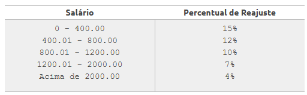

## A empresa ABC resolveu conceder um aumento de salários a seus funcionários de acordo com a tabela abaixo:

<div align="center">



</div>

- Leia o salário do funcionário e calcule e mostre o novo salário, bem como o valor de reajuste ganho e o índice reajustado, em percentual.

### Entrada

A entrada contém apenas um valor de ponto flutuante, com duas casas decimais.

### Saída

Imprima 3 linhas na saída: o novo salário, o valor ganho de reajuste (ambos devem ser apresentados com 2 casas decimais) e o percentual de reajuste ganho, conforme exemplo abaixo.

---
**Exemplo de Entrada**
``` 
400.00
```

---
**Exemplo de Saída**
```
Novo salario: 460.00
Reajuste ganho: 60.00
Em percentual: 15 %
```